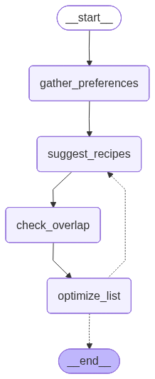

# Recipe Meal Planner

<p align="center">
  
</p>

An intelligent meal planning system built with Google ADK (Agent Development Kit) and LangGraph that creates budget-conscious meal plans with optimized shopping lists.

## Overview

This project demonstrates a multi-agent architecture where specialized AI agents collaborate to plan meals, optimize grocery lists, and ensure budget compliance. The system takes user requests like "Plan 5 dinners under $50 total" and returns a complete meal plan with consolidated shopping lists and cost breakdowns.

## Features

- **Smart Dietary Filtering**: Automatically detects and filters recipes based on preferences (vegetarian, vegan, gluten-free, low-carb)
- **Ingredient Consolidation**: Identifies shared ingredients across recipes to optimize shopping efficiency
- **Budget Optimization**: Ensures meal plans stay within specified budget constraints (default: $50)
- **Cost Calculation**: Generates detailed shopping lists with quantities and prices
- **Structured Output Parsing**: Uses LLM structured output to extract meal planning requirements from natural language

## Technical Features

### ✅1. Multi-agent System 

**Three LLM-Powered Agents**

1. **Orchestrator Agent** (`agents/orchestrator.py`)
2. **Recipe Planner Agent** (`agents/orchestrator.py`)
3. **Code Savvy Agent** (`agents/adk_agent.py`)

### ✅2. Tools 

**Custom Tools:**
- **AgentTool** (`agents/orchestrator.py`) - Wraps agents as callable tools for delegation

**Built-in Tools:**
- **BuiltInCodeExecutor** (`agents/adk_agent.py`) - Enables dynamic Python code generation and execution for budget calculations and cost optimization

### ✅3. Sessions & Memory 

**Session Management:**
- **InMemorySessionService** (`utils.py`) - Creates and manages user sessions with session_id and user_id tracking
- Persistent conversation state across multiple requests (`recipe_meal_planner.py:33-36`)


## Architecture (3-Agent System)

### 1. Orchestrator Agent (`meal_plan_orchestrator`)
- **Role**: Main coordinator that receives user requests and delegates tasks
- **Capabilities**:
  - Routes requests to appropriate specialized agents
  - Ensures meal plans meet budget requirements
  - Formats final output with recipe lists and shopping details

### 2. Recipe Planner Agent (`recipe_planner_agent`)
- **Role**: Handles recipe selection logic using a LangGraph state machine
- **Workflow**: 4-node state machine
  1. `gather_preferences`: Extracts dietary requirements and recipe count using LLM structured output (Pydantic models)
  2. `suggest_recipes`: Selects recipes from database based on preferences
  3. `check_overlap`: Identifies shared ingredients across selected recipes
  4. `optimize_list`: Consolidates ingredients into a unified shopping list
- **State Management**: Uses MemorySaver for checkpointing between nodes
- **Output**: Triggers `[CALCULATE_COST]` flag when ready for cost calculation

<p align="center">
  
</p>

### 3. Code Savvy Agent (`code_savvy_agent_builtin`)
- **Role**: Budget optimization specialist with Python code execution
- **Capabilities**:
  - Calculates total costs using executable Python code
  - Validates budget constraints
  - Suggests substitutions if over budget
  - Generates formatted shopping lists with quantities and prices
- **Code Executor**: BuiltInCodeExecutor for running Python scripts

## Recipe Database

The system includes 10 pre-configured recipes in `recipes.py`.  
Each recipe includes detailed ingredient lists with quantities and individual prices.

## Workflow

```
User: "Plan 5 dinners under $50 total"
              ↓
┌─────────────────────────────────────┐
│   Orchestrator Agent                │
│   (meal_plan_orchestrator)          │
└─────────────────────────────────────┘
              ↓
┌─────────────────────────────────────┐
│   Recipe Planner Agent              │
│   (LangGraph State Machine)         │
├─────────────────────────────────────┤
│ 1. gather_preferences               │
│    - Parse user request             │
│    - Extract dietary restrictions   │
│    - Determine recipe count         │
├─────────────────────────────────────┤
│ 2. suggest_recipes                  │
│    - Filter by dietary tags         │
│    - Select N recipes               │
├─────────────────────────────────────┤
│ 3. check_overlap                    │
│    - Identify shared ingredients    │
│    - Group by item name             │
├─────────────────────────────────────┤
│ 4. optimize_list                    │
│    - Consolidate quantities         │
│    - Set [CALCULATE_COST] flag      │
└─────────────────────────────────────┘
              ↓
┌─────────────────────────────────────┐
│   Code Savvy Agent                  │
│   (code_savvy_agent_builtin)        │
├─────────────────────────────────────┤
│ - Generate Python code              │
│ - Calculate total costs             │
│ - Verify budget constraints         │
│ - Format shopping list              │
└─────────────────────────────────────┘
              ↓
        Final Meal Plan
        (Recipes + Shopping List + Costs)
```

## Project Structure

```
/home/ed/kaggle/recipe/
├── recipe_meal_planner.py      # Main entry point (CLI mode)
├── test_agent.py                # Test script for agent functionality
├── recipes.py                   # Recipe database with 10 recipes
├── utils.py                     # Environment variables & session management
├── __init__.py                  # Package initialization
├── agents/
│   ├── orchestrator.py         # Main orchestrator agent
│   ├── langgraph_agent.py      # LangGraph state machine for recipe planning
│   └── adk_agent.py            # Code execution agent
├── agents_web/                  # ADK Web UI configuration
│   └── recipe_meal_planner/
│       ├── agent.py            # Web UI agent entry point
│       └── __init__.py         # Package initialization
├── .env                        # API keys (shared by CLI and Web UI)
├── requirements.txt            # Python dependencies
├── image1.png                  # Project screenshot
└── README.md                   # This file
```

## Setup & Installation

### Prerequisites

- Python 3.8+
- Google API key with access to Gemini models

### Installation

```bash
# Install uv if you haven't already
curl -LsSf https://astral.sh/uv/install.sh | sh

# Clone the repository
git clone https://github.com/edangx100/Recipe-Meal-Planner.git
cd Recipe-Meal-Planner

# Create virtual environment and install dependencies
uv venv
source .venv/bin/activate  # On Windows: .venv\Scripts\activate

# Install dependencies from requirements.txt
uv pip install -r requirements.txt
```

**Important: Configure your API key**

Edit the `.env` file and replace the placeholder `GOOGLE_API_KEY` with your own Google API key:

```bash
# .env file
GOOGLE_API_KEY=your_actual_api_key_here  # Replace with your real API key

# Model configuration (optional - defaults provided)
DEFAULT_LLM=gemini-2.0-flash              # For general tasks
DEFAULT_REASONING_LLM=gemini-2.5-flash    # For orchestrator
```

To get a Google API key, visit: https://aistudio.google.com/app/apikey

These values are loaded from environment variables with sensible defaults in `utils.py`.

## Usage

### Option 1: ADK Web UI (Recommended - Interactive Interface)

Run the interactive web interface to chat with your meal planner agent:

```bash
# Make sure you're in the project directory
cd /home/ed/kaggle/recipe

# Activate virtual environment
source .venv/bin/activate

# Start ADK web UI (default port 8000)
adk web agents_web
```

Then open your browser to **http://localhost:8000**

**Using a custom port:**

```bash
# Use a different port if 8000 is already in use
adk web --port 8080 agents_web
```

Then open **http://localhost:8080**

**Try these queries in the web UI:**

- "Plan 5 dinners under $50 total"
- "Plan 3 vegetarian dinners under $50 total with a focus on protein"
- "Give me 4 budget-friendly dinner recipes"
- "Plan a week of healthy dinners under $70"

**What you'll see:**
- Real-time streaming of agent responses
- Detailed trace of the LangGraph state machine workflow
- Complete meal plans with recipes, shopping lists, and price breakdowns

### Option 2: CLI Mode (Pre-configured Queries)

Run the command-line version with pre-configured test scenarios:

```bash
python recipe_meal_planner.py
```

The script includes two test scenarios:

1. **Basic meal plan**:
   ```
   "Plan 5 dinners under $50 total"
   ```

2. **Vegetarian with protein focus**:
   ```
   "Plan 3 vegetarian dinners under $50 total with a focus on protein"
   ```

### Expected Output

```
YOU: Plan 5 dinners under $50 total

ORCHESTRATOR: Here is your meal plan:

1. Spaghetti Aglio e Olio
2. Chicken Stir-Fry
3. Black Bean Tacos
4. Lentil Soup
5. Baked Salmon with Veggies

Here is your shopping list:

* spaghetti: 1 lb
* garlic: 1 bulb
* olive oil: 1/2 cup + 2 tbsp
* chicken breast: 1 lb
...

Total Cost: $47.23

Enjoy your meals!
```

## Troubleshooting

### ADK Web UI Issues

**Problem: Port already in use**
```bash
ERROR: [Errno 98] address already in use
```

**Solution:** Use a different port or kill the existing process:
```bash
# Option 1: Use a different port
adk web --port 8001 agents_web

# Option 2: Find and kill the process using port 8000
lsof -i :8000  # Find the PID
kill -9 <PID>  # Replace <PID> with the actual process ID
```